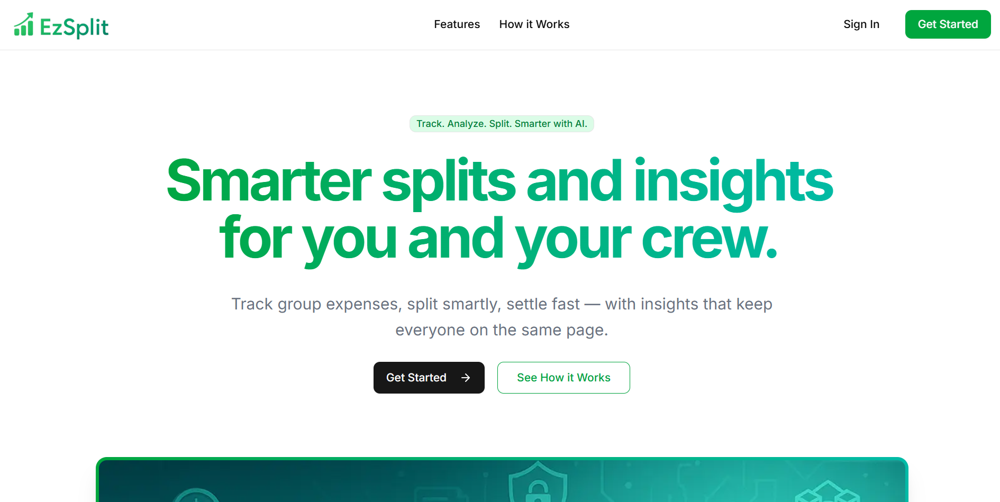
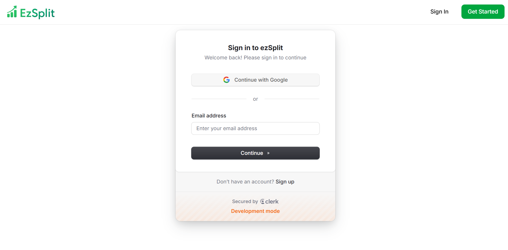
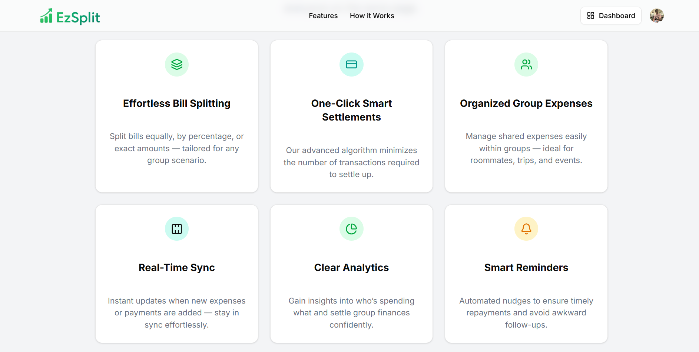
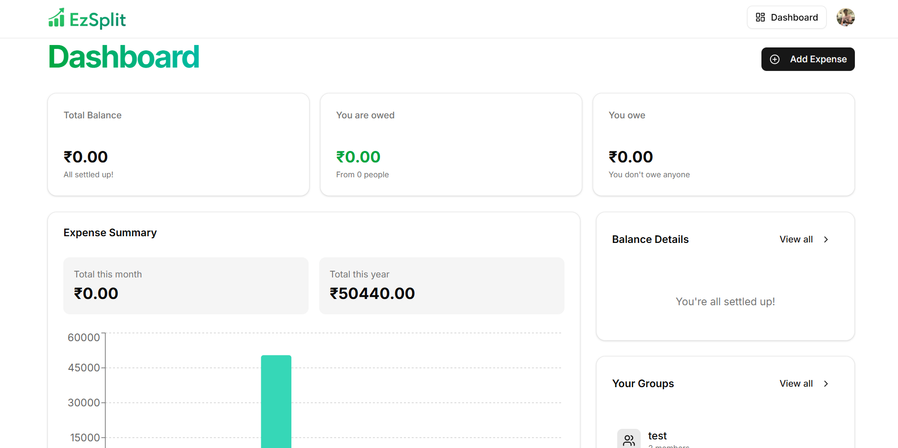
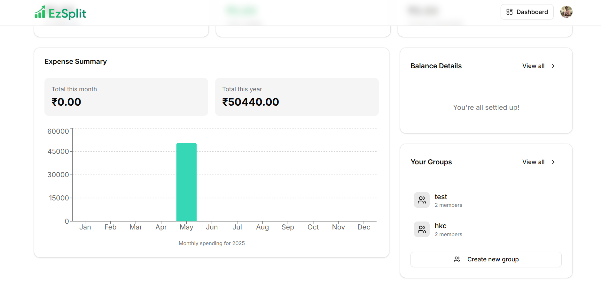

# 💸 ezSplit – AI Powered Expense Tracker & Splitter

[](https://ez-split-f7pf.vercel.app/)
[](https://nextjs.org/)
[](https://tailwindcss.com/)

---

**ezSplit** is a sleek, full-stack **AI-powered expense tracking and splitting app** built with the React + Next.js ecosystem. Perfect for teams, roommates, friends, or solo use — ezSplit uses artificial intelligence to understand and split bills efficiently.

---

## ✨ Features

- ✅ **AI-powered expense understanding** from raw inputs  
- 🤝 **Smart bill splitting** between friends, teams, or roommates  
- 🔁 **Automated payment reminders** via [Inngest](https://innge.st/yt-rsc3)  
- 📊 **Spending insights** delivered intelligently  
- 📱 **Fully responsive design** — works great on mobile, tablet, and desktop  
- 🔐 Seamless user onboarding with [Clerk](https://go.clerk.com/io4ILbV)  
- ⚡ Real-time backend + DB with [Convex](https://convex.link/roadsideai)  
- 🎨 Clean and modern UI with Tailwind CSS + Shadcn UI

---

## 🛠️ Tech Stack

| Purpose               | Tech                                                                 |
|-----------------------|----------------------------------------------------------------------|
| **Frontend**          | React 19, Next.js 15                                                 |
| **Styling**           | Tailwind CSS, Shadcn UI                                              |
| **Authentication**    | [Clerk](https://go.clerk.com/io4ILbV)                                |
| **Backend & Database**| [Convex](https://convex.link/roadsideai)                    |
| **Background Jobs**   | [Inngest](https://innge.st/yt-rsc3) – used for ⏰ payment reminders & 📈 spending insights |
| **Hosting**           | Vercel                                                               |

---

## 🚀 Getting Started

Clone the repo and run the development server:

```bash
git clone https://github.com/AnjeshSingh-NITT/ezSplit.git
cd ezSplit

# Install dependencies
npm install --legacy-peer-deps

# create .env.local file and copy the example

# Start convex backend
npx convex dev

# Run the app
npm run dev
```   

---

## 📁 .env.local.example

```env
NEXT_PUBLIC_CONVEX_URL=http://localhost:3010
```

## 📸 Screenshots

### Landing page


### Login Page


### Features


### Dashboard


